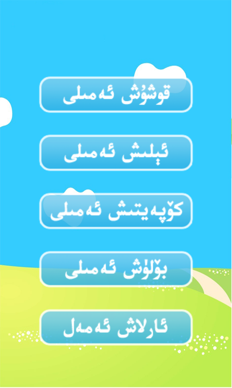
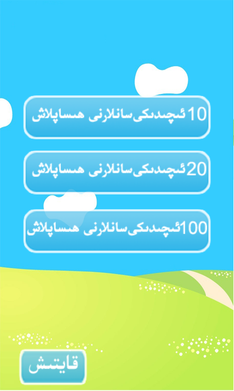
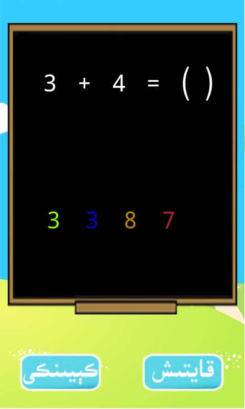

# FourOperators
============

UI Language is in Uyghur.

تۆت ئەمەل مەشىقى

بالىلارنىڭ تۆت قوشۇش، ئېلىش، كۆپەيتىش، بۆلۈش قاتارلىق تۆت ئەمەلنى ئۆگۈنىشىگە ياردەم بىرىدۇ.

Screenshots
---------

Download Link
---------

* [Download from Bilkan Bazar](http://bazar.bilkan.net/App.aspx?id=15)
